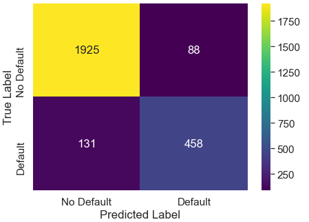

# CREDIT RISK ANALYSIS PROJECT

This is a term project for ``Machine Learning 1`` course under studies of ``Data Science and Business Analytics`` Master's degree program in University of Warsaw, Faculty of Economics Sciences. This project is focused on the ``Classification`` methods for the prediction and a reasonably small dataset was used.

Here is the team members:\

Please find the detailed information of data and problem analysis below.

## Summary of Data

Financial institutions used credit risk analysis models to determine the probability of default of a potential borrower. The models provide information on the level of a borrower’s credit risk at any time. If the lender fails to detect the credit risk in advance, it exposes them to the risk of default and loss of funds. Lenders rely on the validation provided by credit risk analysis models to make key lending decisions on whether to extend credit to the borrower and the credit to be charged.

Credit default risk occurs when the borrower is unable to pay the loan obligation in full or when the borrower is already 90 days past the due date of the loan repayment. The credit default risk may affect all credit-sensitive financial transactions such as loans, bonds, securities, and derivatives.

The level of default risk can change due to a broader economic change. It can also be due because of a change in a borrower’s economic situation, such as increased competition or recession, which can affect the company’s ability to set aside principal and interest payments on the loan.

The data is related with credit risk analysis. Credit default risk is the risk that a lender takes the chance that a borrower fails to make required payments of the loan. The classification goal is to predict the loan defaults (variable **loan_status**) on 32,576 loans and 12 benchmarks.

Defaulting on a loan happens when repayments are not made for a certain period. When a loan defaults, it is sent to a debt collection agency whose job is to contact the borrower and receive the unpaid funds. Defaulting will drastically reduce your credit score, impact your ability to receive future credit, and can lead to the seizure of personal property. If you cannot make payments on time, it is important to contact your lender or loan servicer to discuss restructuring your loan terms.

In this project, it is going to be predict if lender have loan default or not in the payment with binary classification models. 21% of data have positive (1 – have default) output class and 79% of data have negative (0 – do not have default) class. Because of output data is imbalanced, this project can be called as an anomaly detection project and be a tool used to determine the probability of default of a potential borrower.

## Source of Data

https://www.kaggle.com/laotse/credit-risk-dataset

## Attribute Analysis

### Input Variables

1.	**person_age(dbl):** is the age of the person at the time of the loan.
2.	**person_income(dbl):** is the yearly income of the person at the time of the loan.
3.	**person_home_ownership(fct):** is the type of ownership of the home.
4.	**person_emp_length(dbl):** is the amount of time in years that person is employed.
5.	**loan_intent(fct):** is the aim of the loan.
6.	**loan_grade(fct):** is a classification system that involves assigning a quality score to a loan based on a borrower's credit history, quality of the collateral, and the likelihood of repayment of the principal and interest.
7.	**loan_amnt(dbl):** is the dimension of the loan taken.
8.	**loan_int_rate(dbl):** is the interest paid for the loan.
9.	**loan_percent_income(dbl):** is the ratio between the loan taken and the annual income.
10.	**cb_person_default_on_file(fct):** answers whether the person has defaulted before.
11.	**cb_person_cred_hist_length(dbl):** represents the number of years of personal history since the first loan taken from that person.

### Output Variables

12.	**loan_status(fct):** is a dummy variable where 1 is default, 0 is not default.

# SUMMARY AND CONCLUSION

The model has been checked with validation set after training and to see how model behave into the production, it has been simulated by using test data. Both test and validation data results seems reasonable and robust.

If user wants to get better results for precision or recall, threshold of the classifier could be updated for their needs.

For now, default model has output like:

- accuracy: 0.9315910837817064
- precision: 0.9767981438515081
- recall: 0.7147707979626485
- f1 score: 0.8254901960784313

Unique values are..: [0 1]

Accurcy for test data..: 0.9315910837817064

ROC for test data..: 0.9476703633512896

Here is the Confusion Matrix...

Here is the values count of test data...

{0: 2013, 1: 589}

> Here is the results after threshold optimizaiton:

- Results for threshold is ..: 0.23
- accuracy: 0.9158339738662568
- precision: 0.8388278388278388
- recall: 0.7775891341256367
- f1 score: 0.8070484581497797

0: Negative Class ~ Clean | 1: Positive Class ~ Malware

{0: 2013, 1: 589}

### Feature Importance

From LGBM Importance

From Permutation Importance

From the SHAP Values

It can be observe that, top 5 most important feature for credit default detection is:

1. **loan_percent_income:** 
2. **loan_grade:**
3. **person_home_ownership_OWN:**
4. **person_income:**
5. **loan_intent_venture:**

Also, from the shap values, it can be concluded that,

- For high values of ``loan_percent_income`` and ``loan_grade``, model has tendency to predict as **Default**.
- For high values of ``person_home_ownership_OWN``, ``loan_intent_venture`` and ``person_income``, model has tendency to predict as **Not Default**.

These interpretation from the shap values are so informative to understand how model decide and how features effect this model decision.

Further analysis on the results from these misclassified samples might be informative for further improvement. Maybe it can be detected that, there are missing features in the dataset.

## Reference

- https://corporatefinanceinstitute.com/resources/knowledge/credit/credit-risk-analysis-models/